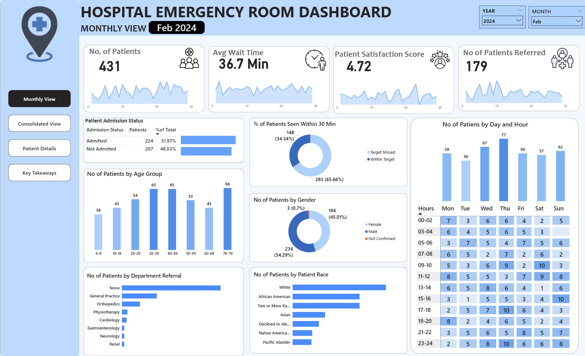
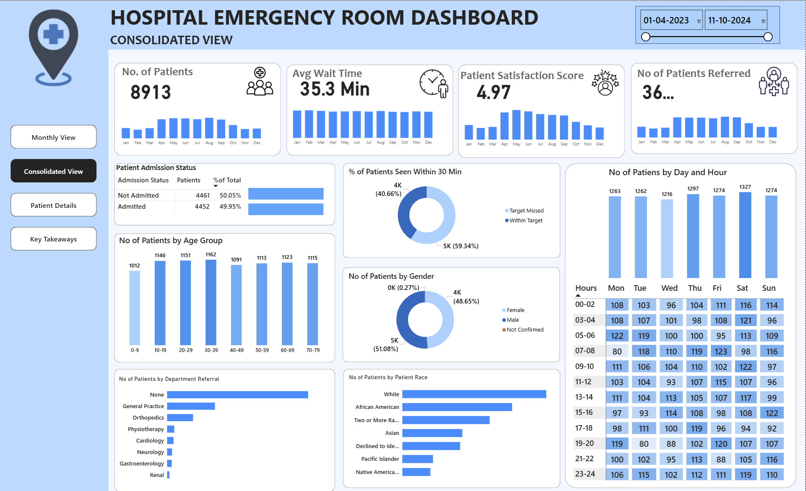
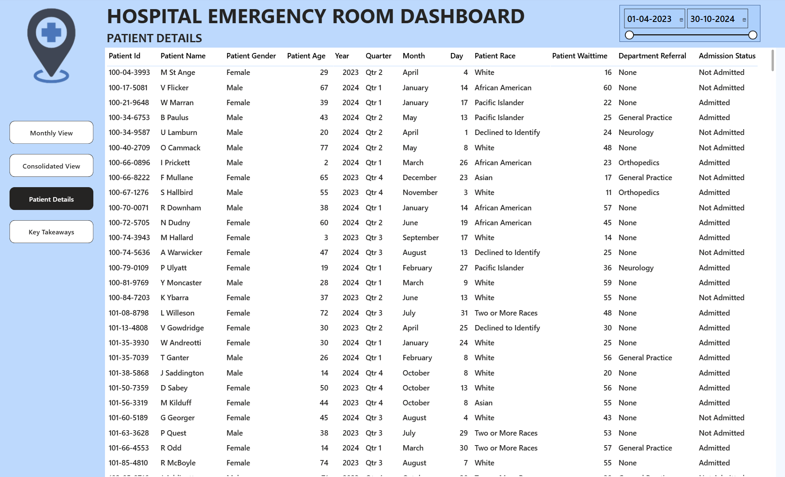
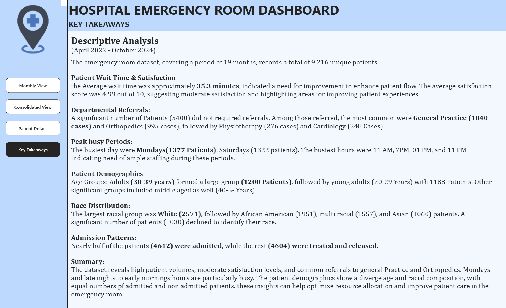

# 🏥 Hospital Emergency Room Analytics Dashboard

## 📊 Project Overview
The **Hospital Emergency Room Analytics Dashboard** is a data analytics project designed to analyze and monitor key operational metrics of a hospital emergency department. The goal of this project is to evaluate patient flow, service efficiency, and department referrals to identify opportunities for improving hospital operations and patient care.

This dashboard provides an interactive visualization of emergency room data, enabling healthcare administrators and analysts to quickly understand trends in patient admissions, waiting times, demographic distribution, and departmental referrals.

By transforming raw healthcare data into meaningful insights, the dashboard supports data-driven decision-making and helps improve operational efficiency in emergency healthcare services.

---

## 🎯 Project Objectives
The main objectives of this project are:

- Analyze emergency room patient data to monitor operational performance.
- Track patient admission status and identify admission patterns.
- Evaluate waiting time efficiency by measuring patients attended within 30 minutes.
- Understand demographic distribution of patients by age and gender.
- Identify department referral trends within the hospital.
- Provide an interactive dashboard for quick insights and data-driven decisions.

---

## 🛠 Tools & Technologies Used
- **Power BI** – Data visualization and dashboard development  
- **Microsoft Excel** – Data storage and preprocessing  
- **Power Query** – Data cleaning and transformation  
- **DAX (Data Analysis Expressions)** – Calculated measures and KPIs  

---

## 📂 Dataset Description
The dataset used in this project contains emergency room patient records including:

- Patient ID
- Age
- Gender
- Admission status
- Department referral
- Waiting time
- Visit date and time

The data was cleaned and transformed using **Power Query** to ensure consistency and reliability before building the dashboard.

---

## 📈 Key Dashboard Insights
The dashboard provides several analytical views to understand emergency room operations:

### 1️⃣ Patient Admission Analysis
Tracks the number of patients admitted versus those not admitted to the hospital. This helps understand the severity of cases handled by the emergency department.

### 2️⃣ Patient Age Distribution
Patients are categorized into **10-year age groups** to identify which age groups frequently visit the emergency room.

### 3️⃣ Department Referral Trends
Analyzes the departments to which patients are referred after emergency treatment. This helps hospital management understand department workload distribution.

### 4️⃣ Timeliness of Service
Measures the **percentage of patients attended within 30 minutes**, which is a key performance indicator for emergency room efficiency.

### 5️⃣ Gender Distribution
Shows the distribution of patients based on gender to understand demographic trends in emergency visits.

---

## 📊 Dashboard Preview

### Emergency Room Dashboard

### Monthly View
A Monthly View provides a month-by-month overview of key hospital metrics to track trends and performance over time. It helps identify patterns in patient admissions, demographics, referrals, and service efficiency.

----------------------------------------------------------------------------------------------------------------------------------------------------------------

### Consolidated Dashboard
A Consolidated View summarizes key hospital metrics over a selected time period to provide a complete performance overview. It helps identify trends and patterns in patient flow and operational efficiency.

-----------------------------------------------------------------------------------------------------------------------------------------------------------------

### Patient Details
A Patient Details View provides detailed patient-level information, including demographics, admission details, wait time, and department referrals. It helps analyze individual patient records for deeper insights and operational troubleshooting.

----------------------------------------------------------------------------------------------------------------------------------------------------------------

### Key Takeaways
A Key Takeaways summarizes insights from all dashboards by highlighting important trends, patterns, and anomalies. It provides clear and actionable insights to help stakeholders improve hospital operations and patient care.

----------------------------------------------------------------------------------------------------------------------------------------------------------------

## 🔍 Key Business Impact
This analytics dashboard helps hospitals:

- Monitor emergency department performance
- Identify delays in patient service
- Improve patient flow management
- Optimize hospital resource allocation
- Enhance healthcare service delivery

The insights generated from the dashboard can support hospital administrators in making informed operational decisions.

---

## 🚀 Future Improvements
Possible enhancements for this project include:

- Integrating real-time hospital data
- Adding predictive analytics for patient inflow
- Incorporating machine learning models to forecast emergency department demand
- Expanding analysis to include treatment outcomes and hospital capacity utilization

---

## 📌 Conclusion
The **Hospital Emergency Room Analytics Dashboard** demonstrates how data analytics and visualization tools like Power BI can transform raw healthcare data into actionable insights. By analyzing key operational metrics, the project highlights how data-driven dashboards can help improve efficiency, patient care, and decision-making in healthcare environments.

---

## 👩‍💻 Author
**Rachana Hebbar**

Aspiring Data Analyst transitioning from an engineering background with experience in **SQL, Power BI, Excel, and Python**. Passionate about transforming data into meaningful insights and building impactful analytics dashboards.

